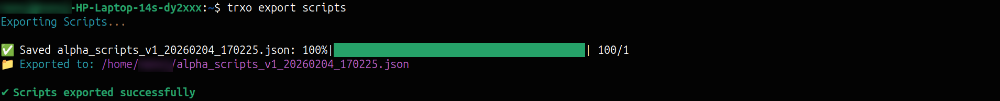
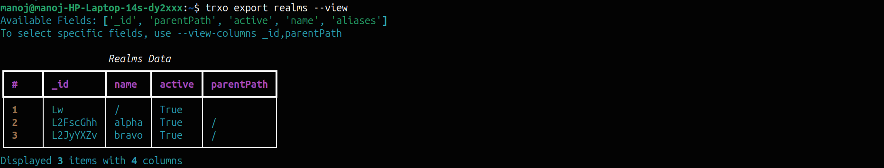
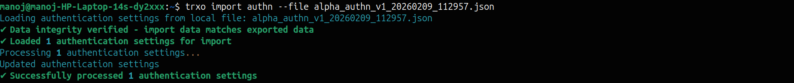
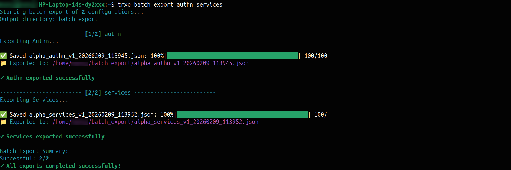

# TRXO Usage Guide

This guide outlines the standard workflow for managing Ping Identity configurations.

## 1. Project Workflow

Start by creating a dedicated workspace for your specific migration or environment task.

**Create a Project:**
```bash
trxo project create my-migration-project
```

**List Projects:**
```bash
trxo projects
```

**Switch Context:**
```bash
trxo project switch my-migration-project
```

## 2. Configuration

Initialize your project configuration for Authentication and Storage.

```bash
trxo config setup
```
*   For detailed **Authentication** options, see [Project Setup & Auth Guide](setup_and_auth.md).
*   For detailed **Storage Mode** setup (Local vs Git), see [Storage Setup Guide](storage_setup.md).

**View Current Configuration:**
```bash
trxo config show
# displays current configuration
```
---

## 3. Export Commands

Export configurations from your source environment.

### Basic Export
```bash
# Export all scripts from the default realm (alpha)
trxo export scripts
```

{: .screenshot}
*Exporting AM scripts to local storage*


### General Options

**Specific Realm:**
Export from a non-default realm (e.g., 'bravo' or root).
```bash
trxo export scripts --realm bravo
```

**View Data (Dry Run):**
Preview data in the terminal without saving to file.
```bash
trxo export realms --view
```

{: .screenshot}
*Previewing realm configuration in the terminal*


**View Specific Columns:**
Restrict the view output to specific fields (e.g., just IDs and Names).
```bash
trxo export realms --view --view-columns _id,name
```

### Local Storage Options (Filesystem Only)

**Custom Directory:**
Save export files to a specific directory. Creates the directory if it doesn't exist.
```bash
trxo export journeys --dir journeys-export
```

**Custom Filename:**
Save to a specific manual filename.
```bash
trxo export journeys --file new-journeys
```

**Specific Version:**
Tag the export file with a semantic version.
```bash
trxo export journeys --version prod-ready
```

### Git Storage Options (Git Mode Only)

**Branch:**
Export to a specific branch. If the branch exists, it adds/updates files; if not, it creates the branch.
```bash
trxo export oauth --branch bravo-oauth2-clients
```

**Commit Message:**
Provide a custom commit message describing the export.
```bash
trxo export oauth --branch bravo-oauth2-clients --message "Exporting OAuth2 Clients from tenant"
```

### CI/CD & Automation
Run exports without interactive prompts or project setup by passing credentials directly.

**PingOne Advanced Identity Cloud (Service Account):**
```bash
trxo export scripts \
  --jwk-path /path/to/private.key \
  --client-id service-account-client-id \
  --sa-id service-account-uuid \
  --base-url https://<tenant>.forgeblocks.com
```

**PingAM (On-Premise):**
```bash
trxo export scripts \
  --auth-mode onprem \
  --base-url https://am.example.com/am \
  --onprem-username amAdmin \
  --onprem-password SecurityPhrase1!
```

---

## 4. Import Commands

Import configurations into your target environment. Options vary based on Local or Git storage mode.

**View Available Commands:**
```bash
trxo import --help
```

### Local File System
Import configuration files from your local directory.

**Standard Import:**
Imports from local file to default realm (alpha).
```bash
trxo import authn --file <file-name>
```

{: .screenshot}
*Importing authentication configuration from a file*


**Specific Realm:**
Import file content to a specific target realm.
```bash
trxo import authn --file <file-name> --realm <realm-name>
```

**Cherry-Pick:**
Import only specific items (single ID or comma-separated list).
```bash
trxo import scripts --file <file-name> --cherry-pick id1,id2
```

**Diff Mode:**
Compare the import file against the target environment before applying changes.
```bash
trxo import scripts --file <file-name> --diff
```

**Sync Mode:**
Mirror the import data to the target (deletes extra items on server).
```bash
trxo import scripts --file <file-name> --sync
```

**Force Import:**
Skip hash integrity checks if file was manually modified.
```bash
trxo import scripts --file <file-name> --force-import
```

### Git Mode
Import configurations directly from the linked Git repository.

**Default Branch:**
Takes data from the currently checked-out branch.
```bash
trxo import scripts
```

**Specific Branch:**
Import data from a specific branch.
```bash
trxo import scripts --branch <branch-name>
```

**Rollback:**
Automatically restore previous state if import fails (Git mode only).
```bash
trxo import scripts --rollback
```

### CI/CD & Automation

**PingOne Advanced Identity Cloud:**
```bash
trxo import scripts --file <file-name> \
  --jwk-path /path/to/private.key \
  --client-id service-account-client-id \
  --sa-id service-account-uuid \
  --base-url https://<tenant>.forgeblocks.com
```

**PingAM (On-Premise):**
```bash
trxo import scripts --file <file-name> \
  --auth-mode onprem \
  --base-url https://am.example.com/am \
  --onprem-username amAdmin \
  --onprem-password SecurityPhrase1!
```

For more detailed explanations, see [Advanced Features Guide](advanced_features.md).

---

## 5. Batch Operations

Execute multiple configuration commands in a single operation.

**View Available Commands:**
```bash
trxo batch --help
```

### Batch Export

**Export All:**
Runs the export for all supported commands.
```bash
trxo batch export --all
```

**Selected Commands:**
Export specific configuration types in one shot.
```bash
trxo batch export authn services
```

{: .screenshot}
*Executing multiple export commands in batch mode*


**Error Handling:**
Pause execution immediately if any command fails (default is `continue-on-error`).
```bash
trxo batch export authn services managed --stop-on-error
```

### Batch Import

**From Directory:**
Searches the directory for files matching the specified commands and imports them.
```bash
trxo batch import --dir batch-export/ command1 command2
```

**From Config File:**
Import using a JSON manifest file containing detailed paths and options.
```bash
trxo batch import --config-file batch_config.json
```

For more details, see [Batch Operations Guide](batch_operations.md).

---

## 6. Log Management

Manage and monitor TRXO application logs for troubleshooting and auditing.

**View Recent Logs:**
Displays the last 20 lines of logs in the console.
```bash
trxo logs show
```

**Advanced Log View:**
Filter logs and follow live output.
```bash
trxo logs show --lines 30 --follow --level INFO
```
*   `--lines`: Specify the number of lines to display from the end.
*   `--follow`: Monitor logs live as they are written.
*   `--level`: Filter by log level (DEBUG, INFO, WARNING, ERROR).

**View Log Configuration:**
Displays log file paths, current level, and retention settings.
```bash
trxo logs info
```
